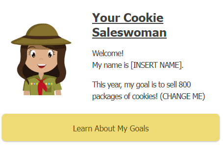

---
tags:
  - projects
---

## 🍪 Coding 4 Cookies 🍪

notes:
Let's learn how to build our very own website!

---

I know what you're thinking

---


*I've never built a website before! I have no idea how??*

---
### ⛔ We aren't jumping Head First


notes:
That's okay, we're not jumping head first into this. In fact, we've got a few things to cover before we build our website.

---
### 📍 Before we can start building websites
- Know what a website is
	- [👉 Examples of websites ]()
	- Website Mental Model
	- Website Activity
- Why are we building a website?
	- What problem are we solving?
	- What types of websites are there?
	- Brainstorming Content Activity
- Design our website
	- Mood board
	- User Flow and Prototype

notes:
Over the next few videos, we'll cover each of these topics before we get started with the fun stuff!
Let's start with the "what" of websites.
# What

---
### What is a website?


- A collection of files on the internet
- We can visit websites through the browser

notes:
Just like a street address, if we wanted to go visit a friends house, we'd go to their address and show up. For websites, if we wanted to visit YouTube, then we would go to YouTube's address. That's what the URL is, an address to a website's files.

---

 ### Websites solve problems.
- We only visit if there's a reason to visit


notes:
Like most things in the world, websites are created to solve problems. If they don't solve problems, there's not really a reason to visit.

---

### 🎯 What's your favorite website?

> [!Activity] 
> Share your favorite website and why you like that website in classroom comment

notes: we can have the students share their website in google classroom comments

---
### 📍 Before we can start building websites
- Know what a website is
	- ~~Examples of websites~~
	- [👉 Website Mental Model]()
	- Website Activity
- Why are we building a website?
	- What problem are we solving?
	- What types of websites are there?
	- Brainstorming Content Activity
- Design our website
	- Mood board
	- User Flow and Prototype
---
### Let's build a mental model

> **[Mental Model](https://jamesclear.com/mental-models#:~:text=The%20phrase%20%E2%80%9Cmental%20model%E2%80%9D%20is,understand%20how%20the%20economy%20works.)**: a representation of how something works

notes:
Mental models are just a well-defined way of saying "yes I know how this works, it works like this." 

We'll be building our own mental model of how websites work but first...

---

### 🍪 Deconstructing a cookie 🍪


notes:
let's start by building a mental model of a cookie so we can get more practice because

---
### 🍪 & 🕸

[Cookies are more like websites]() than you think!

notes:
It turns out that cookies are more like websites than you think.

- Cookies can be defined with 3 characteristics
	- What they're made of
	- How they look
	- The science we used to make them
- Websites can also be defined by 3 characteristics
	- What they're made of
	- How they look
	- The science we used to make them

![[2-Website_Analogy.canvas|Website-Analogy]]

---

### Cookie vs Website

![[2-website_vs_cookie.png | Website vs Cookie]]
notes:
%% This is just the key take away from the mental model %%

---
### 📍 Before we can start building websites
- Know what a website is
	- ~~Examples of websites~~
	- ~~Website Mental Model~~
	- [🎯 Website Activity]()
- Why are we building a website?
	- What problem are we solving?
	- What types of websites are there?
	- Brainstorming Content Activity
- Design our website
	- Mood board
	- User Flow and Prototype

---
### 🔗 [Intro-HTML-Cookies](https://codepen.io/totally-not-frito-lays/pen/dyamGaz)

> [!Activity] 
> Open up this [example](https://codepen.io/totally-not-frito-lays/pen/dyamGaz) and try changing it to say: "Hello world, my name is Alice!"

notes:
Let's try messing around with a real website. Try out the example from our mental model.

---
### 📍 Before we can start building websites
- Know what a website is
	- ~~Examples of websites~~
	- ~~Website Mental Model~~
	- ~~Website Activity~~
- Why are we building a website?
	- [👉 What problem are we solving?]()
	- What types of websites are there?
	- Brainstorming Content Activity
- Design our website
	- Mood board
	- User Flow and Prototype
notes:
Now that we know **what** a website is and what it's made of, let's figure out why we would make a website. This is the **why**, also known as the business side of the project.
# Why
business side of the project

---
### Why are we building a website?

To sell cookies!


---
### Why are we building a website?

To sell cookies > cookies support my troop!


---
### Why are we building a website?

To sell cookies > cookies support my troop > my troop gets to do more cool stuff!


---
### How do do websites help? 

We are building a **marketing** website to leverage **e-commerce** to sell cookies.

---
### How do do websites help? 

We are building a **marketing** website to leverage **e-commerce** to sell cookies.

> **[Marketing](https://www.ama.org/the-definition-of-marketing-what-is-marketing/)**: activity and processes for creating, communicating, delivering, and exchanging offerings that have value for customers.

notes:
they help by giving us a platform to leverage marketing strategies. that is, the process of creating and selling goods to customers/consumers.

---
### How do do websites help? 

We are building a **marketing** website to leverage **e-commerce** to sell cookies.

> **[E-Commerce](https://sell.amazon.com/learn/what-is-ecommerce)**: is the trading of goods and services on the internet

notes:
They also allow us to take advantage of e-commerce, which is just using websites or apps to sell products.

---
### Why E-Commerce?

> [!Source] 
> According to [Shopify](https://www.shopify.com/blog/retail-ecommerce):
> - No cost for "overhead" (building upkeep, rent, utilities, etc.)
> - Travel time is spent by shippers, not buyers

notes:
We are in the information era, which basically means everything is on the internet. It's far easier to find things on the internet than it is in-person. So we put it on the internet and we can enjoy the benefit of not having extra costs for just opening a store and to save time from having to travel to businesses in-person.

It's just easier for both sides.

---
### 📍 Before we can start building websites
- Know what a website is
	- ~~Examples of websites~~
	- ~~Website Mental Model~~
	- ~~Website Activity~~
- Why are we building a website?
	- ~~What problem are we solving?~~
	- [👉 What types of websites are there?]()
	- Brainstorming Content Activity
- Design our website
	- Mood board
	- User Flow and Prototype

notes:

Now that we know what problems we're solving, let's check out what types of websites there are.

---
### What are the [types of websites]()?

notes:
- Generally 2 categories of websites
	- Static - it doesn't change much
	- Dynamic - it changes a lot
- Less of a categories question, more of a spectrum


---
### 📍 Before we can start building websites
- Know what a website is
	- ~~Examples of websites~~
	- ~~Website Mental Model~~
	- ~~Website Activity~~
- Why are we building a website?
	- ~~What problem are we solving?~~
	- ~~What types of websites are there?~~
	- [🎯 Brainstorming Content Activity]()
- Design our website
	- Mood board
	- User Flow and Prototype
---
### 🎯 Brainstorming Content Activity

> [!Activity]
> - ✅ Brainstorm why people should buy cookies. 
> - ✅ Describe who you are.
> - ✅ Brainstorm 4-5 words or emotions
> - ✅ Describe what your troop does
>

notes:
Let's fill out some questions we should answer before we build our website. Check out this [Template](https://docs.google.com/document/d/1re3KItx1baCJy7j0T21a3aVNsxjaJNiFn-8xIdT2__Q/edit?usp=sharing) or write down your answers on a different sheet of paper

- Why buy cookies
	- They’re delicious and they support local troops!
- Who are you?
	- I’ve been a scout for x years. I like to ride bikes and make websites and I want to sell 4 packages of cookies! 
- Words
	- Satisfy
	- Delicious
	- Happy
	- Support
- What does your troop do?
	- Hiking
	- Community Service

---
### 📍 Before we can start building websites
- Know what a website is
	- ~~Examples of websites~~
	- ~~Website Mental Model~~
	- ~~Website Activity~~
- Why are we building a website?
	- ~~What problem are we solving?~~
	- ~~What types of websites are there?~~
	- ~~Brainstorming Content Activity~~
- Design our website
	- [👉 Mood board]()
	- User Flow and Prototype

notes:
Now that we know what a website is and why we want to build one, let's see how we can build one. Starting with the design of the website.
# How
The design side of the project

---
### What is a mood board?

> **[Mood Board](https://www.nngroup.com/articles/mood-boards/#:~:text=A%20mood%20board%20is%20a,cinema%2C%20industrial%20and%20interior%20design)**:  a collage of images, video frames, patterns, or text that convey a certain feeling at a glance. **inspiration board**

notes:
Designers, much like artists can get inspiration from anywhere. So we borrow a technique that artists use called "mood boarding." This is basically a inspiration board where we put in everything that seems interesting to us in one place.

---
### Our mood board

> [!Activity]
> Check out our moodboard!

notes:
- notice how it doesn't have to be pretty
- Includes buyers, sellers, product, and the website type
	- can be any categories but it's generally good to learn how to break down everything that's involved in the website while we're in the design phase
![[5-Moodboard.canvas|5-Moodboard]]
---
### 📍 Before we can start building websites
- Know what a website is
	- ~~Examples of websites~~
	- ~~Website Mental Model~~
	- ~~Website Activity~~
- Why are we building a website?
	- ~~What problem are we solving?~~
	- ~~What types of websites are there?~~
	- ~~Brainstorming Content Activity~~
- Design our website
	- ~~Mood board~~
	- [👉 User Flow and Prototype]()

---

### User flow

> **[User Flow](https://careerfoundry.com/en/blog/ux-design/what-are-user-flows/)**: diagrams that display the movements a user makes when using a product.

notes:
This is important for us to do because it allows us to figure out when the user should make what decisions. In our case, we want to map out how users might land on our website, what they might be interested in, and how we can best streamline this experience.

This is similar to writing an outline before you write an essay or report. You want to know what topics you're visiting in advance, to make sure you get all the important points.

---
### Prototype

> **[Prototype](https://www.figma.com/resource-library/what-is-prototyping/)**: ensure your design works in the hands of a user.

notes:
This is important for us to do because it allows us to see if our plan works. Sometimes when we make designs, we design as engineers and what is easiest for us to make and do. At the end of the day, it's the user experience that's important because it's the user that accomplishes actions that we want to happen.

Here is where we figure out the layout and navigation of our website.

Prototyping is kinda like writing the rough draft. You may have an idea of how our user should visit our site, but until you're actually visiting the site, we don't know for sure if our plan is working. Our mental model may be different from the mental model of our user.

The reason this comes before building the website is that building the website and making changes afterwards is more expensive than prototyping and then making changes to the prototype.

---
## Our user flow and prototype

notes:

Sometimes we get lucky and our user flow is very similar to the prototype. For us, we're going to combine the two into one document. Let's look at our document.

![[3-Our_Cookie_Page.canvas|Website-Our_Cookie_Page]]

---
# Let's build


---
## 📍 Let's build
- [🏗️ HTML]()
	- Hierarchy
	- Tags
		- Anatomy of Tags
		- Structure Tags
		- Content Tags
		- Action Tags
	- Hero Banner
	- Images
	- Action Tags
- CSS
- JavaScript
---
## Hierarchy


notes:
HTML Hierarchy tree is a way of describing how different parts of an HTML page belong to another part.

We call each of these parts, elements. Elements can be nested inside of each other. The best mental model to use for this is a tree. Notice how each leaf belongs to a branch, each branch belongs to a bigger branch, and every branch belongs to the trunk? The same is true for HTML elements.

This makes it really easy for us to see what content belongs to what branch.

Let's breakdown our website into it's hierarchical parts.
- Notice the collapse arrows? we can click this to collapse every sub-branch that belongs to this element.
- This makes it a lot easier for us to see

---
## Tags

notes:
Formally, elements refer to the idea of a smaller part of our HTML tree. We call the actual code for each element, a tag. That's what we see inside the `<>`. For our purposes, we can consider tags to be the same as elements.

---
### Anatomy of a tag

```HTML
<tag></tag>

<tag>content</tag>

<tag attribute="value"></tag>

<tag attribute="value">content</tag>
```

notes:
Each tag is made of 3 parts. The tag name, the attributes, and the content. 

---
### Types of tags

There are [142 different HTML tags](https://devdevout.com/html/how-many-html-tags-are-there) but generally there are only about 3 broad categories.

Purpose:
- Structure
- Content
- Action

---
### Structure

- helps group elements together

> [!Activity]
> Check out this [codepen](https://codepen.io/totally-not-frito-lays/pen/xxMJbgm?editors=1000)!
> - Try moving the content tags around to see how it changes
> - Pay attention to: 
> 	- `<main>`
> 	- `<div>`
> 	- `<section>`
> 	- `<ul>`
> 	- `<body>`

---
### Content

- what fills the website itself

> [!Activity]
> Check out this [codepen](https://codepen.io/totally-not-frito-lays/pen/RwvBNjP)!
> - Try changing the content of each tag
> - Pay attention to:
> 	- `h1`
> 	- `p`
> 	- `span`
> 	- `img`


---
### Action

- triggers some sort of event

> [!Action]
> Check out this [codepen](https://codepen.io/totally-not-frito-lays/pen/wvNxBPg?editors=1111)!
> - Try clicking on the links
> - Notice how the `a` tag can be nested inside other tags?
> - Look for the script tag!

---
## Hero Banner


notes:
Now that we know some of the building blocks / ingredients of our website, let's see how we can piece them together with a little bit of psychology to bring them into our website. 

---

### First impressions

> it takes [50ms](https://www.tandfonline.com/doi/abs/10.1080/01449290500330448) to form an opinion.


notes:
You might've heard that first impressions are important when meeting people, well, the same is true for presenting projects to other people. In fact, we only have [50ms](https://www.tandfonline.com/doi/abs/10.1080/01449290500330448) to make a good first impression. That's as fast as it takes for a humming bird to beat it's wing once!

---
### What is a Hero Banner?

> **[Hero Banner](https://blog.hubspot.com/marketing/hero-image)**: The first thing that visitors on a website see.

notes:
That's why we use hero banners. It's the first part of our website that our visitors will see.

---

### What makes a good Hero Banner?

1. 👀 Eye-catching to keep people on the site
2. ⚡ Describes your website's purpose super duper fast
3. 🦸‍♀️ Features a [Call to Action](https://blog.hubspot.com/marketing/call-to-action-examples)

notes:
Thankfully, making a good hero banner isn't that complicated, all we have to do is make sure our hero banner fulfills these 3 things.

Let's look at our website and see if our Hero Banner fulfills all 3 items.

---

### Update your Hero Banner!

> [!Activity] 
> Go to [Replit](https://replit.com/@HigginsCodes/Web-C4C) and update the hero banner anywhere it says `(CHANGE ME)`
> - use the brainstorming doc from earlier!

---
## Images


notes:
Now we're onto images! If pictures are worth a thousand words, we should remember to use pictures on websites!

---

### Image size

⚠ Images contain more information than text.

- $1\text{ pixel} = rgb(0\to255, 0\to255, 0\to255)$
-  $1 \text{ letter} = 0\to255$

notes:
Up until now, we've been writing a lot of text-based content. It turns out that text is much smaller than images. If you recall from one of the supplemental activities, images are made of tons of pixels and color information that is stored in at minimum, 3 numbers from 0-255. Meanwhile, each letter is represented as a single number. 

---

### Image Performance


$$\text{Image Size} > 5mb$$
notes:
The important thing to learn here is that images can effect performance much more than text. So when picking an image, be mindful of how big it is. The bigger the image, the longer it takes the website to load.

The magic number we shoot for is less than 5mb.

---

### 🎯 Pick your avatar

> [!Activity]
> 
> Change the profile picture at the bottom of the website!

---
## 📍 Let's build
- ~~HTML~~
- [🎨 CSS]()
	- Selectors
	- Theming
	- Design Revisited
- JavaScript

---
### Selectors

---

### Theming

---
### Design Revisited


---
## 📍Let's build
- ~~HTML~~
- ~~CSS~~
- [🧙‍♂️ JavaScript]()
	- Interactivity
	- Data Structures
	- Loops
	- Conditionals
	- Web Components
---
### Interactivity

---
### Data Structures

---
### Loops

---
### Conditionals

---
### Web Components
