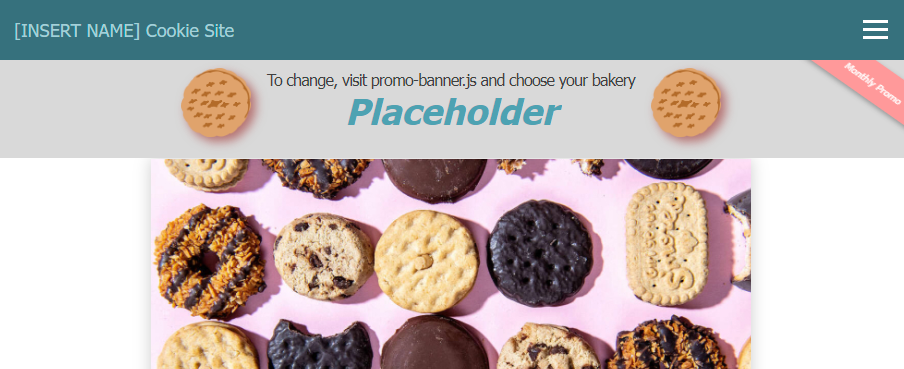
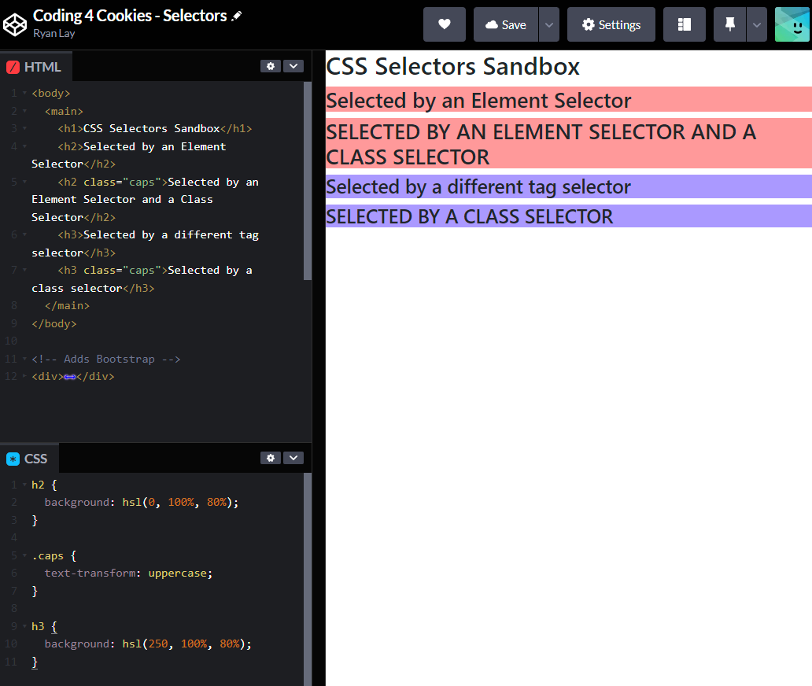
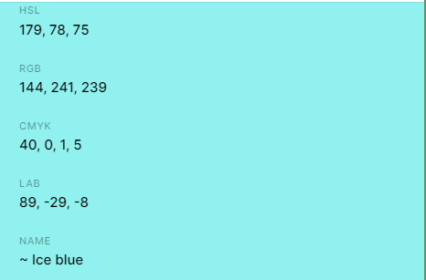
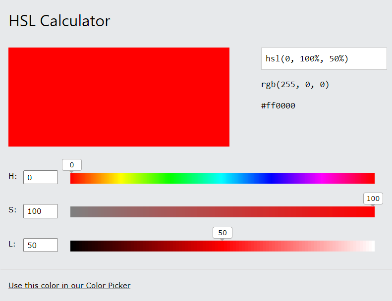
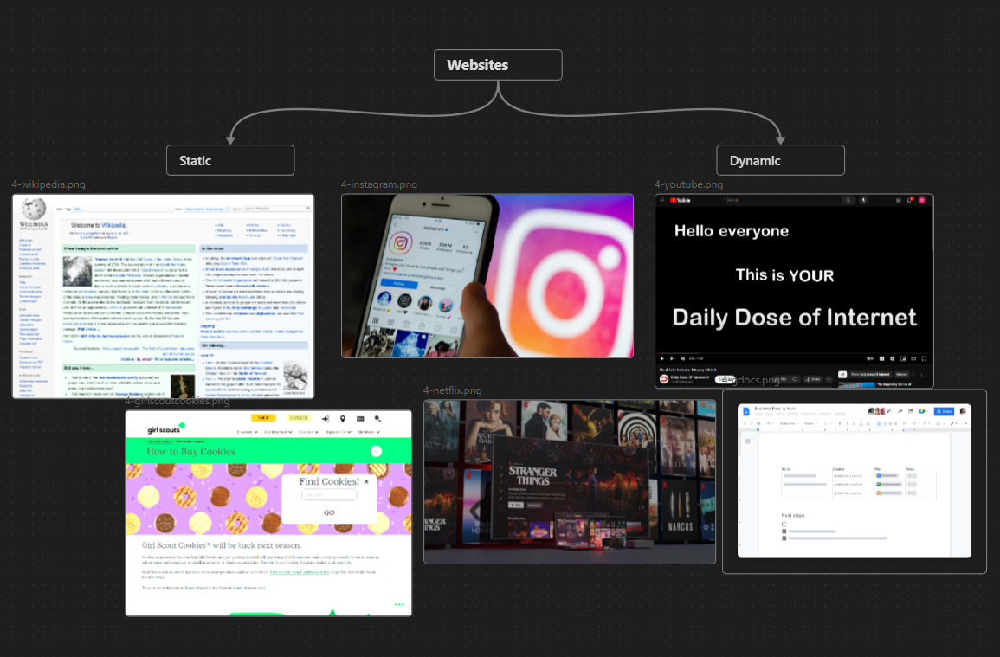

# Coding 4 Cookies 


notes:
Let's learn how to build our very own website!

---

I know what you're thinking

---

### I have no idea how to build a website!


---
### ⛔ We aren't jumping Head First


notes:
That's okay, we're not jumping head first into this. In fact, we've got a few things to cover before we build our website.

---

# Let's design


---
## 📍 Know what a website is
- [👉 Know what a website is]()
	- Examples of websites 
	- Website Mental Model
	- Website Activity
- Why are we building a website?
- Design our website

notes:
Over the next few videos, we'll cover each of these topics before we get started with the fun stuff!
Let's start with the "what" of websites.

---
### What is a website?


- A collection of files on the internet
- We can visit websites through the browser

notes:
Just like a street address, if we wanted to go visit a friends house, we'd go to their address and show up. For websites, if we wanted to visit YouTube, then we would go to YouTube's address. That's what the URL is, an address to a website's files.

---

 ### Websites solve problems.
- We only visit if there's a reason to visit


notes:
Like most things in the world, websites are created to solve problems. If they don't solve problems, there's not really a reason to visit.

---

### 🎯 What's your favorite website?

> [!Activity] 
> Share your favorite website and why you like that website in classroom comment

notes: we can have the students share their website in google classroom comments

---
### Let's build a mental model

> **[Mental Model](https://jamesclear.com/mental-models#:~:text=The%20phrase%20%E2%80%9Cmental%20model%E2%80%9D%20is,understand%20how%20the%20economy%20works.)**: a representation of how something works

notes:
Mental models are just a well-defined way of saying "yes I know how this works, it works like this." 

We'll be building our own mental model of how websites work but first...

---

### Deconstructing a cookie


notes:
let's start by building a mental model of a cookie so we can get more practice because

---
### Cookies are more like websites than you think

notes:
It turns out that cookies are more like websites than you think.

- Cookies can be defined with 3 characteristics
	- What they're made of
		- Structure
			- Butter
			- Flour
			- Eggs
		- Content
			- Sugar
			- Chocolate Chip
			- Peanut Butter
	- How they look
		- Shape
		- Color
		- Arrangement of content
	- The rules the governs how our interactions change the cookie
		- Recipe
		- Time spent in the oven
		- Effects
			- how soft or crunchy it is
			- how hot it is
- Websites can also be defined by 3 characteristics
	- What they're made of
		- These ingredients are described by a file called HTML
	- How they look
		- The appearance are described in a file called CSS
	- The rules that govern how our interactions change the website
		- The science and movement and characteristics of the cookie can be changed with JavaScript

![[2-Website_Analogy.canvas|Website-Analogy]]

---

### Cookie vs Website

![[2-website_vs_cookie.png | Website vs Cookie]]
notes:
Let's look at how well we were able to apply our model of a cookie, to use as an analogy to better understand our website.

---
### 🎯 [Intro-HTML-Cookies](https://codepen.io/totally-not-frito-lays/pen/dyamGaz)

> [!Activity] 
> Open up this [example](https://codepen.io/totally-not-frito-lays/pen/dyamGaz) and try changing it to say: "Hello world, my name is Alice!"

notes:
Let's try messing around with a real website. Try out the example from our mental model.

---
## 📍 Why are we building a website?
- ~~Know what a website is~~
- Why are we building a website?
	- [👉 What problem are we solving?]()
	- What types of websites are there?
	- Brainstorming Content Activity
- Design our website

notes:
Now that we know **what** a website is and what it's made of, let's figure out why we would make a website. This is the **why**, also known as the business side of the project.

---
### Why are we building a website?

To sell cookies!


---
### Why are we building a website?

To sell cookies > cookies support my troop!


---
### Why are we building a website?

To sell cookies > cookies support my troop > my troop gets to do more cool stuff!


---
### How do do websites help? 

We are building a **marketing** website to leverage **e-commerce** to sell cookies.

notes:
So how do websites help? Well, it gives us a platform. What we're officially building is a marketing website to leverage e-commerce to sell cookies.

---
### How do do websites help? 

We are building a **marketing** website to leverage **e-commerce** to sell cookies.

> **[Marketing](https://www.ama.org/the-definition-of-marketing-what-is-marketing/)**: activity and processes for creating, communicating, delivering, and exchanging offerings that have value for customers.

notes:
Let's break down our goal. Marketing. Marketing is the process of selling goods to customers.

---
### How do do websites help? 

We are building a **marketing** website to leverage **e-commerce** to sell cookies.

> **[E-Commerce](https://sell.amazon.com/learn/what-is-ecommerce)**: is the trading of goods and services on the internet

notes:
E-Commerce, that's the practice of selling goods on the internet.

---
### Why E-Commerce?

> [!Source] 
> According to [Shopify](https://www.shopify.com/blog/retail-ecommerce):
> - No cost for "overhead" (building upkeep, rent, utilities, etc.)
> - Travel time is spent by shippers, not buyers

notes:
But why sell it on the internet if it's easy enough to open up a stand and sell it ourselves?

Well, we are in the information era, which basically means everything is on the internet. 

It's far easier to find things on the internet than it is in-person. So we put it on the internet. This also has the benefit of not costing extra for overhead and upkeep, or the price of renting, utilities, and other things we need to spend money on to stay open). It also is more convenient because we can outsource shipping costs to somebody else.

It's just easier for both sides.

---
### What are the [types of websites]()?

notes:
Now that we know what problems we're solving, let's check out what types of websites there are.

- Generally 2 categories of websites
	- Static - it doesn't change much
	- Dynamic - it changes a lot
- Less of a categories question, more of a spectrum
- Where does an e-commerce website land?
	- somewhere in the middle


---
### 🎯 Brainstorming Content Activity

> [!Activity]
> - ✅ Brainstorm why people should buy cookies. 
> - ✅ Describe who you are.
> - ✅ Brainstorm 4-5 words or emotions
> - ✅ Describe what your troop does
>

notes:
Now that we know about why we would build a website and what types of websites there are. Let's write down some information about our goals, ourselves, and our product.

To do this, check out this [Template](https://docs.google.com/document/d/1re3KItx1baCJy7j0T21a3aVNsxjaJNiFn-8xIdT2__Q/edit?usp=sharing) or write down your answers on a different sheet of paper.

- Why buy cookies
	- They’re delicious and they support local troops!
- Who are you?
	- I’ve been a scout for x years. I like to ride bikes and make websites and I want to sell 4 packages of cookies! 
- Words
	- Satisfy
	- Delicious
	- Happy
	- Support
- What does your troop do?
	- Hiking
	- Community Service

---
## 📍 Design our website
- ~~Know what a website is~~
- ~~Why are we building a website?~~
- [👉 Design our website]()
	- Mood board
	- User Flow and Prototype

notes:
Now that we know what a website is and why we want to build one, let's see how we can build one. Starting with the design of the website.

---
### What is a mood board?

> **[Mood Board](https://www.nngroup.com/articles/mood-boards/#:~:text=A%20mood%20board%20is%20a,cinema%2C%20industrial%20and%20interior%20design)**:  a collage of images, video frames, patterns, or text that convey a certain feeling at a glance. **inspiration board**

notes:
Designers, much like artists can get inspiration from anywhere. So we borrow a technique that artists use called "mood boarding." This is basically a inspiration board where we put in everything that seems interesting to us in one place.

---
### Our mood board

> [!Activity]
> Check out our moodboard!

notes:
- notice how it doesn't have to be pretty
- Includes buyers, sellers, product, and the website type
	- can be any categories but it's generally good to learn how to break down everything that's involved in the website while we're in the design phase
![[5-Moodboard.canvas|5-Moodboard]]

---

### User flow

> **[User Flow](https://careerfoundry.com/en/blog/ux-design/what-are-user-flows/)**: diagrams that display the movements a user makes when using a product.

notes:
This is important for us to do because it allows us to figure out when the user should make what decisions. In our case, we want to map out how users might land on our website, what they might be interested in, and how we can best streamline this experience.

This is similar to writing an outline before you write an essay or report. You want to know what topics you're visiting in advance, to make sure you get all the important points.

---
### Prototype

> **[Prototype](https://www.figma.com/resource-library/what-is-prototyping/)**: ensure your design works in the hands of a user.

notes:
This is important for us to do because it allows us to see if our plan works. Sometimes when we make designs, we design as engineers and what is easiest for us to make and do. At the end of the day, it's the user experience that's important because it's the user that accomplishes actions that we want to happen.

Here is where we figure out the layout and navigation of our website.

Prototyping is kinda like writing the rough draft. You may have an idea of how our user should visit our site, but until you're actually visiting the site, we don't know for sure if our plan is working. Our mental model may be different from the mental model of our user.

The reason this comes before building the website is that building the website and making changes afterwards is more expensive than prototyping and then making changes to the prototype.

---
### Our user flow and prototype

notes:

Sometimes we get lucky and our user flow is very similar to the prototype. For us, we're going to combine the two into one document. Let's look at our document.

![[3-Our_Cookie_Page.canvas|Website-Our_Cookie_Page]]

---
# Let's build


---
## 📍 HTML - Ingredients
- [🏗️ HTML]()
	- Hierarchy
	- Tags
		- Anatomy of Tags
		- Structure Tags
		- Content Tags
		- Action Tags
	- Hero Banner
	- Images
	- Action Tags
- CSS
- JavaScript
---
## HTML Hierarchy


notes:
HTML Hierarchy tree is a way of describing how different parts of an HTML page belong to another part.

We call each of these parts, elements. Elements can be nested inside of each other. The best mental model to use for this is a tree. Notice how each leaf belongs to a branch, each branch belongs to a bigger branch, and every branch belongs to the trunk? The same is true for HTML elements.

This makes it really easy for us to see what content belongs to what branch.

Let's breakdown our website into it's hierarchical parts.
- Notice the collapse arrows? we can click this to collapse every sub-branch that belongs to this element.
- This makes it a lot easier for us to see

---
### Tags

notes:
Formally, elements refer to the idea of a smaller part of our HTML tree. We call the actual code for each element, a tag. That's what we see inside the `<>`. For our purposes, we can consider tags to be the same as elements.

---
### Anatomy of a tag

```HTML
<tag></tag>

<tag>content</tag>

<tag properties="value"></tag>

<tag properties="value">content</tag>
```

notes:
Each tag is made of 3 parts. The tag name, the properties, and the content. Properties describe how the tag should behave and look. 

All tags have default properties that we can override but typically they have those default properties to fulfill a specific task.

---
### Types of tags

There are [142 different HTML tags](https://devdevout.com/html/how-many-html-tags-are-there) but generally there are only about 3 broad categories.

Purpose:
- Structure
- Content
- Action

notes:
It turns out that there are a lot of different types of tasks to fulfill for websites. 142 of them! Thankfully we don't always need to use that many. Something else that's nice is that there's only really 3 categories that we care about. Structure, Content, and Action tags.

---
### Structure

- helps group elements together

> [!Optional]
> Check out this [codepen](https://codepen.io/totally-not-frito-lays/pen/xxMJbgm?editors=1000)!
> - Try moving the content tags around to see how it changes
> - Pay attention to: 
> 	- `<main>`
> 	- `<div>`
> 	- `<section>`
> 	- `<ul>`
> 	- `<body>`

---
### Content

- what fills the website itself

> [!Optional]
> Check out this [codepen](https://codepen.io/totally-not-frito-lays/pen/RwvBNjP)!
> - Try changing the content of each tag
> - Pay attention to:
> 	- `h1`
> 	- `p`
> 	- `span`
> 	- `img`


---
### Action

- triggers some sort of event

> [!Optional]
> Check out this [codepen](https://codepen.io/totally-not-frito-lays/pen/wvNxBPg?editors=1111)!
> - Try clicking on the links
> - Notice how the `a` tag can be nested inside other tags?
> - Look for the script tag!

---
## Website Building Blocks


notes:
Now that we know some of the atomic pieces of our website, (that means) very small branches and leaves, we can start putting them together in building blocks of our website. That's kinda like mixing the dry ingredients together separately from the wet ingredients. Or making our cookie in pieces.

By using building blocks, we can build faster and with more familiarity.

---
## Hero Banner


notes:
First up is the first thing that people see on a website. The Hero Banner.

---

### First impressions

> it takes [50ms](https://www.tandfonline.com/doi/abs/10.1080/01449290500330448) to form an opinion.


notes:
You might've heard that first impressions are important when meeting people, well, the same is true for presenting projects to other people. In fact, we only have [50ms](https://www.tandfonline.com/doi/abs/10.1080/01449290500330448) to make a good first impression. That's as fast as it takes for a humming bird to beat it's wing once!

---
### What is a Hero Banner?

> **[Hero Banner](https://blog.hubspot.com/marketing/hero-image)**: The first thing that visitors on a website see.

notes:
That's why we use hero banners. It's the first part of our website that our visitors will see.

---

### What makes a good Hero Banner?

1. 👀 Eye-catching to keep people on the site
2. ⚡ Describes your website's purpose super duper fast
3. 🦸‍♀️ Features a [Call to Action](https://blog.hubspot.com/marketing/call-to-action-examples)

notes:
Thankfully, making a good hero banner isn't that complicated, all we have to do is make sure our hero banner fulfills these 3 things.

Let's look at our website and see if our Hero Banner fulfills all 3 items.

---

### 🎯 Update your Hero Banner!

> [!Activity] 
> Go to [Replit](https://replit.com/@HigginsCodes/Web-C4C) and update the hero banner anywhere it says `(CHANGE ME)`
> - use the brainstorming doc from earlier!

---
## Images


notes:
Now we're onto images! If pictures are worth a thousand words, we should remember to use pictures on websites!

---

### Image size

⚠ Images contain more information than text.

- $1\text{ pixel} = rgb(0\to255, 0\to255, 0\to255)$
-  $1 \text{ letter} = 0\to255$

notes:
Up until now, we've been writing a lot of text-based content. It turns out that text is much smaller than images. If you recall from one of the supplemental activities, images are made of tons of pixels and color information that is stored in at minimum, 3 numbers from 0-255. Meanwhile, each letter is represented as a single number. 

---

### Image Performance


$$\text{Image Size} > 5mb$$
notes:
The important thing to learn here is that images can effect performance much more than text. So when picking an image, be mindful of how big it is. The bigger the image, the longer it takes the website to load.

The magic number we shoot for is less than 5mb.

---

### 🎯 Pick your avatar

> [!Activity]
> 
> 
> 
> Change the profile picture at the bottom of the website!

---

## Call to Action


notes:
The next building block, is the call to action!

---

### CTA Definition

> **[Call to Action](https://blog.hubspot.com/marketing/call-to-action-examples)**: part of the website that encourages the audience to do something!

notes:
This is a marketing tool that is used to get the audience to do something! In our case, we want the users to buy cookies so we need to sprinkle in "suggestions" about what we want them to do.

---

### CTA types

| | |
| --- | --- |
| Button | |
| Banner |  |
| Popup |  |

notes:
There are a few different types of Call to Actions, but generally we have these 3 options. One is a button with a link to do something or visit another page. Then we have Banners which are a persistent part of the website that let's us know when something is happening. Finally we have pop-ups or slide-ins. These are kinda spammy and normally force us to do something about it. It's not a really good user experience but it's good at forcing people to take action.

---

### What makes a good CTA?

1. It's simple
2. Uses action verbs
3. Creates a sense of urgency
4. Is creative

notes:
[Source](https://blog.hubspot.com/marketing/call-to-action-examples)

---

### 🎯 Update Buy/Shop Buttons

> [!Activity]
> Update the buttons to point to your personal cookie pages.

---
## 📍 CSS - The Style
- ~~HTML~~
- [🎨 CSS]()
	- Selectors
	- Theming
	- Design Revisited
- JavaScript

notes:
Now, we're onto the style. We're looking to make our cookie website look nice.

---
## Selectors


notes:
The core part of CSS is not about writing content. In the same way we can't make a cookie look cool if we don't have the ingredients to make the cookie, we can't make a website look cool if we don't have HTML.

Because of this, the core part of CSS is selectors. This is how we describe what part of the cookie / website, we want to style. 

---

### Selector types

1. ✅ Element 
2. ✅ Class
3. ⛔ ID 
4. ⛔ Inline 

notes:
Elements or tags, will grab all the tags of that type and apply the styles we have defined.

Meanwhile classes are a property we can apply to different types of tags to style them in the same way. This gives us the chance to have more control over "categories" of elements to style.

We only use these top two in the website we're building.

The following two are for grabbing a single element. The `ID` option allows us to grab it from a CSS file like the rest of the selectors by defining a property. The `inline` allows us to set CSS styles directly as a property itself.

---

### Optional Selector Activity



> [!Optional]
> If you're curious, you can check out this [CSS selector example](https://codepen.io/totally-not-frito-lays/pen/KKJBRmq?editors=1100).

notes:

After looking at the example, try looking through our website to see how we use selectors to theme everything!

---
### Optional CSS Variables Activity


> [!Optional] 
> If you're curious, you can also check out this [CSS variables example](https://codepen.io/totally-not-frito-lays/pen/xxMJjzM).

---

## Design Revisited

### UI / UX

User Interface / User Experience


notes:
We've been getting busy building our blocks that we've forgotten to talk about the most important people to this project. The user. 

We previously talked about how it can be easy for us as engineers to build what's easiest for us to build. 

---
### Easy as the flick of a switch?


notes:

When it comes to the design of a website, it can be tempting to think of it as just a visual problem. Just pick what looks nice *ya doyyyy*.

However, once you dive into the world of user interfaces and user experience, you'll quickly find that there are other things to consider. There is so much here that there's an entirely separate professional field dedicated to just UI/UX.

---
## Identity

1. [👉 Identity]()
2. Readability
3. Discoverability

notes:
Let's reel things back a little bit. When it comes to the UI/UX of our website, we should consider these 3 things. There's generally a lot more than these 3 things to consider, but we're focusing on these for now.

---

### Identity

> [Brand Identity](https://blog.hubspot.com/agency/develop-brand-identity)
> 
> | Logo | Product | Mission |
> | --- | --- | --- | 
> | 🌐 | 🍪 | 💸 |

> [Visual Identity](https://www.wix.com/blog/visual-identity)
> 
>  | Colors | Fonts | Graphics |
>  | --- | --- |  --- |
>  | 🎨 | 🔡🅱 | 🌄

notes:
When it comes to identity, we can consider two types: brand identity and visual identity. Brand identity refers to our logo, a single image that represents what we do; our product, the thing we're offering; our mission, what we're hoping to achieve. This is typically handled by the business side of companies.

Then there's the visual identity. This is defined by colors, fonts, and graphics. We already have the graphics chosen out for you since this is a cookie website, but let's talk about colors here and we'll talk about fonts in readability.

---
### How many colors do we have?

> [!Question] 
> How many colors do we use on our website?
> (not including images)

notes:

We use 2 in the navigation bar, one for the primary font, one for the white font, one for the ribbon, one for the promotion banner shadow, one for the promotion banner font, two for the buttons, one for the cookie cards, one for the shadow, and two for the goals page. That's a total of 13 different colors. But we forgot to mention the most common color on the website, the white! 

That brings us to a grand total of 5 colors in our color palette.

---

### Purpose of each color

| Color     | Area             | UI Purpose    |
| --------- | ---------------- | ------------- |
| 🔵 Blue   | Navigation       | Brand Color   |
| 🟡 Yellow | Buttons          | Actions       |
| 🔴 Red    | Promotion Banner | Alert         |
| 🟤 Brown  | Section Content  | Content       |
| ⚪ White  | Background       | Neutral Color |


notes:

Well, at first glance, we use blues for the navigation, yellows for the CTAs, a red for the banner, browns for the dividers, and white for the background. To frame this more formally, we have a brand color of blue, secondary / action colors of yellow, alert colors for red, content colors for brown, and neutral color for the white.

---

### Color Palettes


[Color Palette Generator](https://coolors.co/generate)

notes:
Now we know what purposes we're working to fill, let's figure out what colors we should actually use. There are so many color options we can pick from it can be hard to decide so I like to use a [color palette generator](https://coolors.co/generate).

You can use any palette generator, I like this one because it's easy to use.

Hit space bar to cycle the colors, the padlock to lock a color choice in and keep randomizing the others. When you're done, go ahead and click the `view` button and copy the `hsl` value.

---

### Color formats



notes:
There are tons of ways to describe colors. The human way is to describe it with words based on things we're familiar with like "ice blue" for a light blue. 

Another common way is with RGB, which describes how much Red, Green, or Blue is in a color. 

---
### HSL



Hue Saturation Lightness

notes:
The format I like to use is HSL, which stands for Hue, Saturation, Lightness. I really like to use this option because the first option, Hue, defines what general color on the color wheel we're looking at. Saturation tells us how vibrant the color is. Lightness will give us different variations of the color.

Let's check out how we're using it in the website.

Notice how each section of colors has a lot of colors in common. Notice how they all seem like they sort of belong next to each other. Using HSL helps us generate more colors that are part of the core color palette. That's a nice benefit we have as a result of using HSL. You don't get that benefit with other color formats.

---

### Choose your own color theme!

> [!Activity]
> Change the colors to your own theme!
> - only change the hue values 
> - `hsl(hue, saturation, lightnes)`

notes:
Now it's your turn to customize the website colors! I recommend you only change the hue value. You can use the palette generator but only use the hue. Alternatively you can simply change the first value and see what colors you end up with.

---

## Readability

1. ~~Identity~~
2. [👉 Readability]()
3. Discoverability

notes:
Now we're done with colors and identity, let's check out readability.

---

### Readability definition

> [Readability](https://anchordigital.com.au/articles/read-between-the-lines-why-legibility-and-readability-is-essential-for-ux#:~:text=Readability%20is%20the%20arrangement%20of,font%20are%20from%20one%20another.): Arrangement of fonts and words in order to make written content flow more easily.

notes:
Readability is about making sure your content is easy to read. The best content in the world isn't going to be worth a penny if nobody can understand it.

That's why when we choose fonts and colors, we want to make sure we can still read what's going on.

Normally this is where we'd talk about spacing, font size, kerning, padding, line length, and contrast, but the biggest thing is just check to make sure your eyes don't hurt when you're reading it. 

If you want to really dig into the science of it, you can check out this article on the [user experience of readability](https://anchordigital.com.au/articles/read-between-the-lines-why-legibility-and-readability-is-essential-for-ux#:~:text=Readability%20is%20the%20arrangement%20of,font%20are%20from%20one%20another.).

---
### Fonts


notes:
When it comes to fonts, we have a lot more options than you might think. Do you want to be formal or perhaps playful? Do you want to be casual or serious? Fonts can help a lot when deciding the tone and voice of your website. 

---

### Web-Safe Fonts

> [Web-Safe Fonts](https://blog.hubspot.com/website/web-safe-html-css-fonts): fonts that can adapt to any browser, even if the aren't installed.

notes:
Typically we'd have to import in fancy fonts but that can cause issues on some browsers or devices that don't have that font installed. Honestly the web-safe fonts still give quite a lot of options.

You can check out all the different font options on this [article from hubspot](https://blog.hubspot.com/website/web-safe-html-css-fonts).

---

### 🎯 Readability Font

> [!Activity] 
> Pick a new web-safe font! See the [full-list of web-safe fonts](https://anchordigital.com.au/articles/read-between-the-lines-why-legibility-and-readability-is-essential-for-ux#:~:text=Readability%20is%20the%20arrangement%20of,font%20are%20from%20one%20another).
> - Make sure it's readable!

---

## Discoverability

1. ~~Identity~~
2. ~~Readability~~
3. [👉 Discoverability]()

notes:
Next up is discoverability. Even good content won't mean anything if we can't find it! So let's make sure our pages are all easy to find.

---

### Navigation Bar


notes:
Here's our third building block pattern. the navigation bar. This is the one stop shop to visit every webpage we have access to.

These can be complicated to talk about and make so for now, I'll just show you what they look like and what they do.

When we click this stack of bars, also known as a hamburger menu, notice how it slides out? that makes it accessible for us to see at any size. When we full screen this website, it'll sit at the top of the screen.

---

## 📍 JS - The Science
- ~~HTML~~
- ~~CSS~~
- [🧙‍♂️ JavaScript]()
	- Interactivity
	- Data Structures
	- Loops
	- Conditionals
	- Web Components

notes:
Part of the reason the navigation bar was so complicated is because it uses this dark sorcery thing we call javascript.

If you recall, from our mental model, javascript filled in the role of baking science. It changed the way that our cookie dough baked and looked. 

In the same way, Javascript allows us to move around our navigation bar.

---
## Interactivity


notes:
Remember this? JavaScript is the sauce that allows us to move between static and dynamic webpages. Static sites have almost everything written with just HTML and CSS. Dynamic sites have a lot more that is controlled by JavaScript. Usually it's generated using a design pattern known as component-based design. We'll cover more of that later.

---
### Interactive JS Example
- [Cloth Simulation](https://codepen.io/dissimulate/pen/nYQrNP)
- [Star Wars Intro Crawl](https://codepen.io/TimPietrusky/pen/AGrxGb)
- [Animated Snow](https://codepen.io/ste-vg/pen/GqaZbo)
- [Typing Test](https://codepen.io/Hyperplexed/pen/MOObKy)

notes:
The important thing to know now about JavaScript is that we can do things like this.

---
## Data Structures

- Variables
- Arrays
- JSON

notes:
When we use JavaScript, we have to keep in mind that what we're doing is describing in another language exactly what we want to accomplish. 

Part of describing what we want to accomplish is describing how we should store information. 

The way that we humans store information is by writing it down somewhere. Either in a note taking app or on paper.

Machines do the same thing, except instead of paper or an app, they write their notes in memory. It's different from human memory because their memory is fixed and doesn't change as easily as ours does. 

Machines have different ways they can store and organize information just like how we can store and organize information in boxes.

For machines they use variables, arrays, and objects or some combination of all of these options. 

We'll build a mental model of data structures by using an analogy of storing cookies.

Variables can store almost anything. It's like putting things on the table in a taped off area. You can basically put anything on the table. If I said this square here is going to be the home for my cookies, then when I want to find my cookies, I just look for where I taped off the area for my cookies. Sometimes it's possible to put something else that's not supposed to be in that taped off area. Like somebody else's cookies, or even worse, something that's not cookies, like an apple. Now I wouldn't want to put apples where I put my cookies otherwise when I want cookies and I get apples, I'd be very confused. 

Now for arrays. Arrays are a serialized list of variables. That's fancy speak for saying variables that sit next to each other. Let's imagine I wanted to collect a bunch of different cookies. Normally I'd need to make a new space for my new cookies on the table. Eventually we'll end up with cookies all over the place and that's not very tidy. Instead of looking for a bunch of different cookie zones, I could try to organize them in a filing cabinet instead. So now when I want a cookie, I could just look for my cookie filing cabinet instead. If I wanted the second cookie, I'd just look at the second drawer of my filing cabinet. If I wanted to take all of the cookies out, then I would go through my filing cabinet and open each drawer out individually while I'm there.

JSON is very specific to JavaScript. It's so specific that it's literally short for JavaScript Object Notation. Why would we need a new data type specifically for JavaScript? Well it's because it's flexible and easy to understand. JSON generally has a pattern of a "key" and a "value," just like how dictionaries have a "word" and a "definition." For us, we use JSON to store all of our definitions of different cookies. In our model, we could say that JSON objects are like boxes that have names in them. We can put boxes inside of boxes. We can put even smaller series of boxes inside other boxes, just like filing cabinets. If I wanted to reach a box that was inside 4 other boxes, I'd have to open the outer most box first, then get the next outer most box and so on.

Before we can look at how data structures are used in our website, we have to look at how JavaScript grabs HTML or CSS elements. After all, we can't have bakery science without the cookie, can we? 

Just like CSS, JavaScript can grab HTML elements. When we grab HTML through JavaScript, this is known as the document object model, or the DOM. From here on out, when we talk about DOM elements, we mean HTML elements that are in JavaScript. That's because JavaScript speaks a different language than HTML but it has tools to help interpret the language. Tools in JavaScript and programming languages are known as functions. Functions are a set of instructions that run on some input and it can produce some output or change the object it was used on. 

To better understand JavaScript, let's change our mental model to that of an archeologist. We're going to be the Archeologist and we can only speak in JavaScript. We found an ancient sheet of paper that is written in "HTML." We're going to call this sheet of paper, the `document`. Now while we can't read it ourselves, we can use a translator to pick out specific parts of the document to use. This tool is used for both translating and for picking a specific part to use. The tool we use for translating from HTML to JavaScript is the `querySelector()`.  This tool works by attaching it to the document, then telling it what part of the document we want to translate. The nice thing is that it translates in a very similar way to CSS. We can grab tags by specifying the tag name, or we could grab classes by the class name and putting a `.` before it. We can also grab by a specific ID by using a `#` instead.

Now while we could translate the whole document once and not have to worry about translating it, we have to keep in mind that once we translate it, we have to store our translation in boxes. When we translate the entire document at once by using: `document.querySelector("html");`, what we're doing is getting a really big box with tons of tiny boxes. We get one box for each element in the HTML tree. Websites, like most trees, have lots of branches. Most of the time, we only care about specific branches or boxes so we typically grab what we need when we need it.

---
## Loops

Loops are a function, or tool, that we can use to repeat a task over and over again. There's a few ways we can describe repeating. We can repeat an action on a data structure until we run out of boxes or filing cabinets to check. Or we could just repeat this action until we've searched the first, for example, 5 times. 

Most of the time we use loops to work very closely with data structures.

---
## Conditionals

Conditionals are a function / tool that we can use to only work sometimes. Except we can define when that sometimes is true. This allows us to decide if we reject a cookie because it contains something we don't like or are allergic to. Let's say we're allergic to peanut butter. We can use a conditional to say: "hey, if it has peanut butter, then I'm not eating it."

We'll use this as a way to decide if we're using cookies that are from one bakery or another. Check out the next activity for more details.

---
## Events

For events, let's change our model to role play as a environmental scientist stationed in the Antarctic. In this model, the HTML document is the environment and events are the weather events. While we're just hanging out, doing science, we can sometimes see events happening in front of us snow storms or the Aurora Borealis. Well we really want to know when that happens so that we can take a picture of the Aurora Borealis when it comes or shelter away when a snowstorm is coming but we have science work to do most of the time.

So that we can do our normal job and also be ready for snow storms or the Aurora, let's take out some more tools / functions. In this case, we're going to bring out some sensors, called `eventListener`'s. These will listen to any sort of input we tune it to listen to. We can attach our listener to a mountain to listen for snow. When the snow comes, we can tell it to send us an alert! We can attach a separate listener on our base to let us know when the sky is really bright at night to tell us that the Aurora is out!

In the real world with real JavaScript, we attach event listeners to HTML DOM elements. Except the events that we listen to are a lot less cool. The most common ones we use are "click" or "onload". Adding event listeners to different elements allows us to change the website based on interactions from the user.

Now that we've been through all of this, let's try reading some of the JavaScript that we have on our website. Just a heads up, JavaScript is complicated and we've only just reached the tip of the iceberg. If you don't understand everything that's going on, that's okay.

Let's check out the logic for `scripts.js`
- What do you see?
	- constant variable or box that contains the DOM element of something that has the ID of "mobile-men-trigger-open
	- we have a function that is being stored in a constant variable
		- the function toggles or flips the switch on a class to either open or not
	- we add an event listener to one of the DOM elements and we give it a tool
		- that tool is the function which flips the switch

---
## Web Components

Up until now, most of the content on our HTML page has been statically written. That means it was written in pure HTML or CSS. When we were categorizing our website, we mentioned that we had some dynamic content.  [dynamic](https://www.merriam-webster.com/dictionary/dynamic) means it is "marked by continuous and productive activity or change." To describe content as dynamic, that means that our content is changing. In our website, we change our content based off of the contents of JSON files.

Let's look at `index.html` and look for where the dynamic content is. Notice how the places where we defined dynamic content doesn't have something written there in the HTML? It's generated by JavaScript.

Let's talk about why we would use dynamic content.

Dynamic content is useful for generating content around something that changes. In our website, what's the stuff that's going to change or there's a lot of? Well there's two main things that I can think of. Number one, the cookies page! If we decide to change bakeries, then the types of cookies will change. Rather than changing this manually with HTML, we can change this with JavaScript. This allows us to pull from a local JSON file if we're with one bakery, or to a different JSON file if we're with a different bakery. If we're really fancy, we could add another layer of complexity by asking the bakeries themselves what cookies they have. That would making an API call and we can talk about that in another project. 

We could also use this strategy to dynamically update our promotion banner based on the time of year it is. As a marketing strategy, sometimes it helps to showcase a specific cookie. So we can do that with components as well. This makes it easy for us to drop dynamic content into specific parts of the website.

