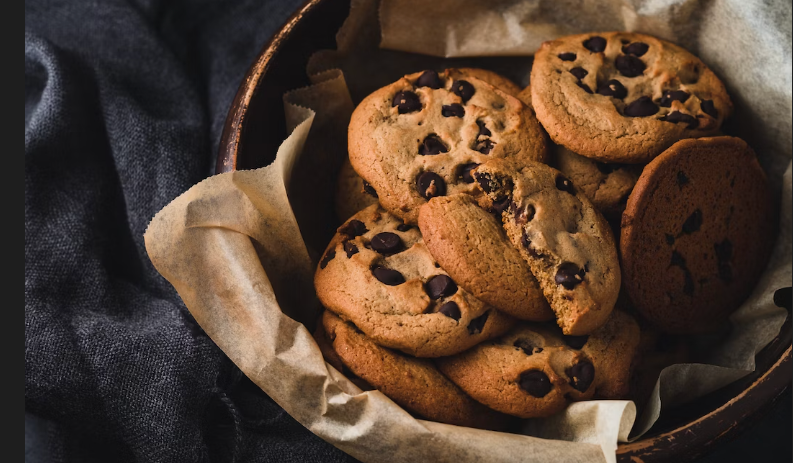

## Images

notes:
Now we're onto images! If pictures are worth a thousand words, we should remember to use pictures on websites!

---

### Image size

> Pictures are worth a thousand words

- $1\text{ pixel} = rgb(0\to255, 0\to255, 0\to255)$
-  $1 \text{ letter} = 0\to255$

notes:
Up until now, we've been writing a lot of text-based content. It turns out that text is much smaller than images. If you recall from one of the supplemental activities, images are made of tons of pixels and color information that is stored in at minimum, 3 numbers from 0-255. Meanwhile, each letter is represented as a single number. 

---

### Image Performance

$$\text{Image Size} < 5mb$$
notes:
The important thing to learn here is that images can effect performance much more than text. So when picking an image, be mindful of how big it is. The bigger the image, the longer it takes the website to load.

The magic number we shoot for is less than 5mb.

---

### 🎯 Pick your avatar

> [!Activity]
> 
> 
> 
> Change the profile picture at the bottom of the website!
