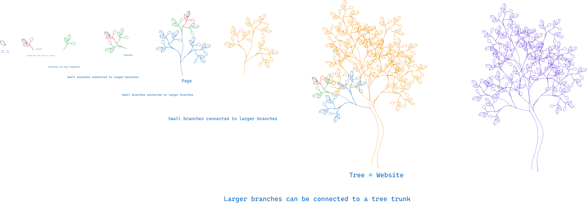

## 📍 HTML Recap

- Types of Tags
- Created a new model of HTML
- Looked at Hero Banners
- Looked at Pictures
- Learned about Call to Action

notes:

Alright that's all the stuff I can teach you about HTML today, so let's do a quick recap before jumping onto the next topic!

---
### What are the three types of HTML tags?

---
### What are the three types of HTML tags?

The three types of HTML tags are:

```html
<main class="structure">
	<p class="content">content</p>
	<a class="action">action</a>
</main>
```

---

### What is HTML similar to?

> what did we compare HTML to?
---
### What is HTML similar to?

A Tree!



---

### What makes a good hero banner?


---

### What makes a good hero banner?

1. 👀 Eye-catching to keep people on the site
2. ⚡ Describes your website's purpose super duper fast
3. 🦸‍♀️ Features a [Call to Action](https://blog.hubspot.com/marketing/call-to-action-examples)

---
### How many words is a picture worth?

---


---
### What are the 3 types of Call to Actions?

---

### What are the 3 types of Call to Actions?

- buttons
- banners
- pop-ups

---

## 🎊 That's it for HTML! 🎊

We now have our ingredients all together, now let's figure out how to describe how our website should look!

