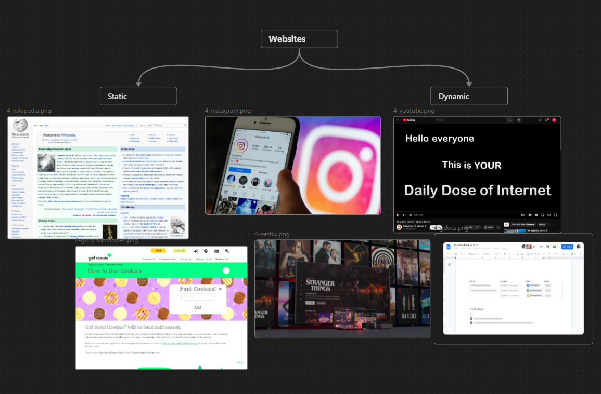

notes:
Remember this? JavaScript is the sauce that allows us to move between static and dynamic webpages. Static sites have almost everything written with just HTML and CSS. Dynamic sites have a lot more that is controlled by JavaScript. 

---
### Interactive JS Example

> [!Activity]
> Check out any one of these projects! Add your own favorite!
> - [Cloth Simulation](https://codepen.io/dissimulate/pen/nYQrNP)
> - [Star Wars Intro Crawl](https://codepen.io/TimPietrusky/pen/AGrxGb)
> - [Animated Snow](https://codepen.io/ste-vg/pen/GqaZbo)
> - [Typing Test](https://codepen.io/Hyperplexed/pen/MOObKy)
> 

notes:
The important thing to know now about JavaScript is that we can do things like this. Go ahead and check out these examples, poke around codepen and see if you can find another one that's really cool.